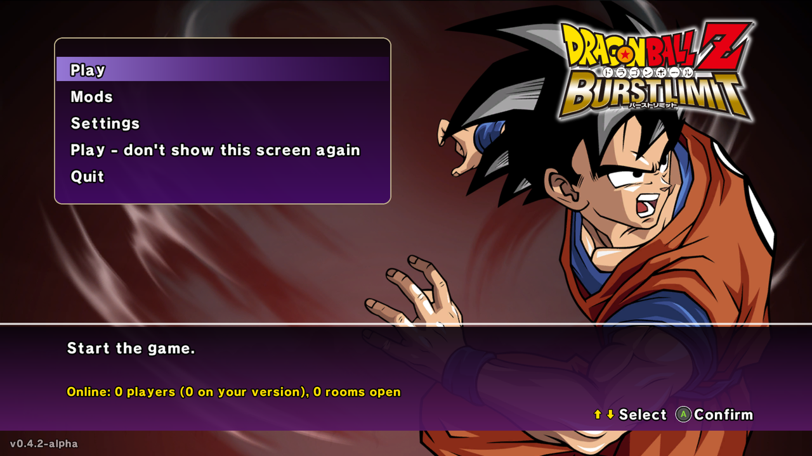
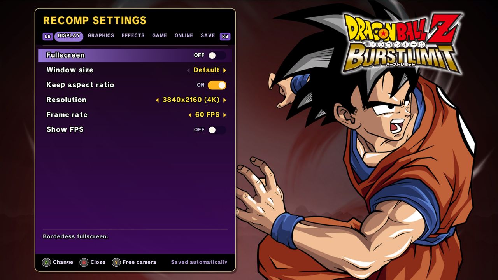
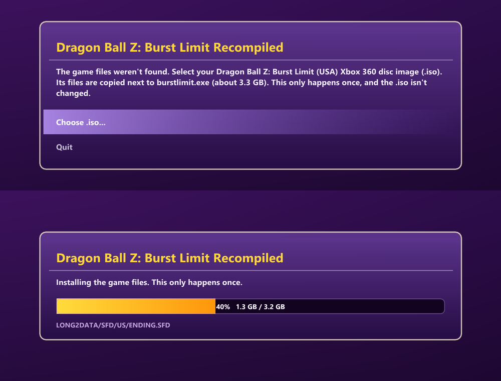

<p align="center">
  
</p>

<p align="center">
  <a href="https://ko-fi.com/iexplosiverage"></a>
</p>

# Dragon Ball Z: Burst Limit Recompiled

A static recompilation of **Dragon Ball Z: Burst Limit** (Xbox 360) to native Windows x64, built on the
[ReXGlue](https://github.com/rexglue/rexglue-sdk) recompiler/runtime.

The game's PowerPC code is translated ahead of time into C++ and compiled with Clang, so it runs as a
normal Windows program instead of inside an emulator.

> **This repository contains no game data.** You need your own legally obtained copy of the game.
>
> **Only the US (NTSC-U) version of the game works.** The game code is translated ahead of time from the US
> `default.xex`; other versions (European/PAL, Japanese) aren't supported. See [Which version](#which-version).

---

## Features

- **Native x64 build** of the game code (no JIT), Direct3D 12 renderer.
- **Install from your disc image**: on the first start without game files, pick your Burst Limit (USA) Xbox 360
  `.iso` and the game files are copied next to `burstlimit.exe` (about 3.3 GB, once). The `.iso` is checked to be
  the US version first and isn't changed. `--install_iso=<path>` does the same without the file picker.
- **Start screen** (`start_screen`) in the game's own style - the main menu's Goku, the logo, the game's font
  and menu sounds, read from your game files: **Play**, **Mods**, **Settings**, **Update** and who's online
  right now (players, how many on your version, the open rooms). "Play - don't show this screen again" skips it.

  

- **Updates from inside the game** (`update_check_url`): when GitHub has a newer release, the start screen shows
  an **Update** button that downloads it, puts its files next to the exe (keeping `burstlimit.toml`, the game
  files, saves, mods and textures) and restarts.
- **Faster rendering**: clears done in place instead of EDRAM transfers, no per-frame re-upload of untouched
  memory, and the unclipped draws' extents worked out on the CPU - about **2x the FPS at native 4K** (100 -> 190+
  on an RTX 4080) and +40 % with DLAA; +32 % on an AMD integrated GPU at 1080p.
- **In-game settings menu**: **F1**, or **Back + Start** on the controller, in the game's menu style (its font,
  menu box, button icons and sounds): DISPLAY, GRAPHICS, EFFECTS, GAME, ONLINE and SAVE. Resolution, window size,
  upscalers, frame rate, field of view, post effects, free camera and more; changes apply right away and are
  saved to `burstlimit.toml`.

  

- **Window size** (`window_size`, when not fullscreen): 512x448 up to 2560x1440, and **Keep aspect ratio**
  (`present_letterbox`): black bars, or the picture stretched to fill the window (a 4:3 screen, say).
- **Frame rate cap** (`frame_rate`): 30 (the original), 60, 120, 144 or unlocked, with fixes for pause, quitting
  a match and Training's "Reset Standing Position" above 30 FPS.
- **Resolution and upscaling**: internal resolution up to 4K and beyond, changeable while playing; AMD FSR 1/2/3
  and CAS sharpening, FXAA, anisotropic filtering, and a **Texture detail** option (`texture_lod_bias`) for
  sharper textures in the distance.
- **AMD FSR 4 / FSR 3.1.5** (`fsr_mode`, `fsr_sharpness`): AMD's anti-aliasing and upscaling for the 3D scene,
  like DLSS below (same jitter, motion vectors and HUD handling). **FSR 4** on AMD RX 9000 GPUs (and RX 7000 with
  AMD's FSR 4 driver support), **FSR 3.1.5** on any other GPU. **Native AA** keeps the resolution; **Quality** to
  **Ultra Performance** render the scene lower and upscale it. FSR 4 hasn't been tested on AMD hardware yet -
  reports welcome.
- **NVIDIA DLSS and DLAA (experimental)** (`dlss_mode`, `dlss_preset`): NVIDIA's AI anti-aliasing and upscaling
  on RTX GPUs, applied to the 3D scene before the HUD, with the jitter and camera motion vectors it needs
  reconstructed from the game's draws. **DLAA** keeps the chosen resolution; **Quality**, **Balanced**,
  **Performance** and **Ultra Performance** render the scene lower and upscale it, for more FPS, while the HUD
  is still drawn at the full resolution.
- **Sharper picture** (`soft_filter`): the game's last pass blurs the whole picture slightly (a soft look made
  for 720p). Above 720p it took away much of the resolution's sharpness, so it's off by default now; turn it
  back on in Settings > Effects > Soft filter.
- **Field of view** option (`field_of_view`, 50-200 %), applied where the game builds its projection, so
  the effects it places on the screen (flares, speed lines, distortions) stay on the fighters.
- **Cleaner image at high resolution**: the game's depth of field, glow blur and motion blur sample at fixed 720p
  distances, which leaves halos and ghost copies around the characters above 720p. They are off by default and
  can be turned back on (`depth_of_field`, `glow_blur`, `motion_blur`).
- **Smooth cutscenes**: the story's cutscenes moved the characters and the camera at 30 FPS even with the game
  at 60. At a frame rate of 60 or more they now move at the full 60.
- **Four hidden costumes** (`story_costumes`): costumes the game only uses in Z Chronicles, now on the character
  select with **Y** (Change Color): Goku battle-damaged (from the fight with Frieza) and Goku as Ginyu (green
  scouter), Kid Gohan in his Raditz-saga outfit, and Teen Gohan battle-damaged (Cell Games), with all their
  transformations.
- **Three new stages** (`extra_stages`): **Dying Namek**, **Wasteland** and **Seaside Cliffs**, stages the game
  only uses in Z Chronicles, are added to the stage select of Versus and Training, with their own pictures,
  and RANDOM can pick them too. Offline only: online matches keep the original list.
- **Start transformed**: on the character select, **RB / LB** pick the form a character starts the match in
  (Super Saiyan Goku, Final Form Frieza, Perfect Cell, ...), shown in a tag under its name with the form's face.
  Works in Versus, Training and online lobby matches (each player picks their own; the choices are sent to
  the other PC); Z Chronicles battles keep their own forms. `start_forms` turns it off (online: the host's
  setting is used by both players).
- **Free camera / photo mode** (`free_camera`): fly the camera anywhere - also in cinematics and super attacks -
  hide the HUD, zoom and tilt. **Freeze game** (`freeze_game`) stops the fight and its cutscenes while you move
  around (offline only). Keyboard: **Insert** and **Numpad 0**, both rebindable in the settings menu. For
  repeatable shots, the console commands `free_camera_where` (logs the current camera as a command) and
  `free_camera_pose <x> <y> <z> <yaw> <pitch> [fov] [roll]` (puts the camera there).
- **Sharp Xbox Series, PlayStation and Nintendo Switch button icons** (`button_icons`): the game's small Xbox 360
  button prompts - menus, tutorials
  and the fight HUD's "press repeatedly" buttons, the settings and Mods menus - show the buttons of the
  controller in use, by position (A = Cross / B, B = Circle / A, LB = L1 / L, ...), drawn at high resolution, and
  the Xbox 360 pad of Control Settings and the tutorial becomes an Xbox Series controller, a DualSense or a pair
  of Joy-Cons. **Auto**
  follows the controller you play with; Settings > Game > Button icons picks one.
- **FPS panel** (F3): frame rate, frame time graph, render resolution and upscaler, in any corner.
- **Mods menu** (`mods_enabled`): a **Mods** entry in the main menu, under Options, in the game's own style and
  sounds (and on the start screen). A mod is a folder in `mods\` next to `burstlimit.exe` with replacement game files named like the files
  in `LONG2DATA_US.CPK` (for example `BCGOK002.NUX`); PlayStation 3 model mods are converted on the fly. Switches
  apply without restarting, from each file's next load. The game's archive itself is never changed. Online, rooms
  only match players with the same mods on. See [Mods](#mods).
- **Ki charge** (`ki_charge`, `ki_charge_rate`, off by default): hold **L3** to charge Ki, like Shin Budokai - on
  the ground or in the air, with a finishing pose when the gauge is full, the Aura Spark motion and wind / dust in
  your aura's color. Works online (the host's setting is used by both players).
- **"Online" instead of "Xbox LIVE"** (`online_branding`): the menus' text and the **Online Battle** title.
- **Save export / import** (Settings > Save): your save as a zip in the `saves` folder next to `burstlimit.exe`,
  and back - also saves exported from Xenia. The current save is backed up first.
- **Online over the internet, no VPN** (`online_lobby_url`): rooms appear in the game's own Player Match menus
  (Create Match / Custom Match), served by a small lobby server; the two PCs then connect directly (ICE with
  STUN hole punching, a TURN relay when that isn't possible). See [Online play](#online-play).
- **Smooth online fights** (`online_input_delay`): every frame's input is sent right away over a side channel
  and both PCs run it a fixed number of frames later (2-8, the host's choice), instead of the game's 3-frame
  packs - no slow motion while the ping stays under the delay. The guest takes the host's online settings, every
  datagram is sent again a few ms later (`online_redundancy`), and a desync check compares the fight's state
  every frame. Rooms are only listed between identical builds.
- **Older online method over LAN / Radmin VPN**: Xbox LIVE sign-in, session create/search/join and player
  matches, emulated on top of plain UDP, with a configurable match driver step (`online_fast_tick`,
  `online_tick_sleep`): the game normally sends input in 12-frame batches (~1 second of input delay even on LAN).
- **Texture dumping / replacement** (`texture_dump_enabled`, `texture_replace_enabled`): put a texture pack in
  `textures\replace` and turn on **Texture pack** in the settings menu. PNG and DDS (BC1/BC2/BC3/**BC7** and
  uncompressed) files are read. Replacements get mipmaps and never stall the game: one not decoded yet shows the
  original texture for a moment while it's decoded and its upload prepared in the background
  (`texture_replace_async`) - with a large DDS pack the worst hitch went from 1.7 s to 0.07 s, about the same as
  without a pack. Small packs are also decoded at startup; bigger ones (over `texture_replace_ram_mb`) load as
  they're used, and the least recently used ones leave RAM.
- **Play time fix**: the game counts play time in presented frames, so above 60 FPS it ran fast; it counts real
  time now.
- **Discord status** (`discord_presence`): your Discord profile shows that you're playing and what - the menus,
  Z Chronicles, Training, Versus or online - through the Discord app's local connection (no SDK or DLL).
- **The game's menu sounds** (`menu_sounds`) on the start screen and in the settings menu, read from the game's
  sound bank.

---

## Download (no build needed)

Grab the latest **alpha** from the [Releases page](https://github.com/iExplosiveRage/DBZ-Burst-Limit-Recompiled/releases):

1. Download `DBZ-Burst-Limit-Recompiled-*.zip` and extract it anywhere.
2. Run `burstlimit.exe`. The first time, it asks for your Burst Limit (**US version**) Xbox 360 `.iso` and
   installs the game files from it. (Or copy your extracted game files into the `game_data_root` folder yourself,
   see [Game files](#game-files).)

<p align="center"></p>

Building from source (below) is only needed if you want to change the code.

### Linux / Steam Deck
Download `DBZ-Burst-Limit-Recompiled-*-linux.zip` instead: the same build with
[vkd3d-proton](https://github.com/HansKristian-Work/vkd3d-proton) and [DXVK](https://github.com/doitsujin/dxvk)
(Direct3D 12 to Vulkan) next to it and a `run_linux.sh` launcher for Wine. Put your game files in
`game_data_root` and run `./run_linux.sh`. Steam / Proton works too: add `burstlimit.exe` as a non-Steam game
and force Proton Experimental in its Compatibility settings. The `.iso` install works there too.

---

## Requirements

### To play
- Windows 10/11 x64
- A GPU with Direct3D 12 support
- Your own copy of Dragon Ball Z: Burst Limit for Xbox 360, **US (NTSC-U) version**, extracted to a folder
  (see [Game files](#game-files))

### To build
| Tool | Version | Notes |
|---|---|---|
| [Visual Studio 2022](https://visualstudio.microsoft.com/) | 17.x | Install the **Desktop development with C++** workload (for the Windows SDK and linker). |
| [LLVM / Clang](https://github.com/llvm/llvm-project/releases) | 20 or newer (tested with 21.1) | `clang` / `clang++` must be on `PATH`. |
| [CMake](https://cmake.org/download/) | 3.25 or newer | |
| [Ninja](https://github.com/ninja-build/ninja/releases) | 1.11 or newer | Must be on `PATH`. |
| [Git](https://git-scm.com/) | any recent | Needed for the SDK submodule. |

About 15 GB of free disk space is needed for the SDK dependencies and build output. A full first build takes
10–30 minutes depending on your CPU.

---

## Getting the source

```bat
git clone --recursive https://github.com/iExplosiveRage/DBZ-Burst-Limit-Recompiled.git
cd DBZ-Burst-Limit-Recompiled
```

If you cloned without `--recursive`:

```bat
git submodule update --init --recursive
```

The ReXGlue SDK lives in `thirdparty/rexglue-sdk` (branch `burstlimit` of
[iExplosiveRage/rexglue-sdk](https://github.com/iExplosiveRage/rexglue-sdk)). It contains the Burst Limit
specific runtime changes (online, settings menu, upscalers, frame pacing, texture replacement, overlay,
codegen fixes).

---

## Game files

The released build installs them from your `.iso` on its first start (see [Download](#download-no-build-needed)).
To do it by hand, or to build from source: extract your copy of the game (for example with `extract-xiso`) and copy it into a folder called
`game_data_root` at the root of this repository:

```
DBZ-Burst-Limit-Recompiled/
└─ game_data_root/
   ├─ default.xex
   └─ LONG2DATA/
      ├─ LONG2DATA_US.CPK
      ├─ STREAM_US.CPK
      ├─ STREAM_JP.CPK
      ├─ SFD/
      └─ SOUND/
```

`default.xex` is needed at **build time** (the recompiler reads it) and the whole folder is needed at
**run time**.

### Which version
Only the **US (NTSC-U)** Xbox 360 version works. This project is built from this `default.xex`:

| | |
|---|---|
| Region | NTSC-U (USA) |
| Size | 7,983,104 bytes |
| SHA-1 | `aec598f88cf51181fc377b148e0b1ad30db4485c` |

To check yours: `certutil -hashfile default.xex SHA1` on Windows, `sha1sum default.xex` on Linux.

With another version the game closes right after it opens, and its log (in the `logs` folder next to
`burstlimit.exe`) shows `No function registered at ...`. The recompiled code only matches the US
`default.xex`, so another version would need its own build.

---

## Building

From a normal command prompt in the repository folder:

```bat
build.bat
```

`build.bat` will:
1. Find Visual Studio 2022 and set up the x64 build environment.
2. Fix the symlinks inside the SDK's `libmspack` submodule (Git for Windows checks them out as text files).
3. Configure with the `win-amd64-relwithdebinfo` CMake preset.
4. Run the recompiler (generates `generated/default/*.cpp` from `default.xex`).
5. Build `out\build\win-amd64-relwithdebinfo\burstlimit.exe`.

To build manually instead:

```bat
cmake --preset win-amd64-relwithdebinfo
cmake --build out\build\win-amd64-relwithdebinfo --target burstlimit_codegen
cmake out\build\win-amd64-relwithdebinfo
cmake --build out\build\win-amd64-relwithdebinfo --target burstlimit
```

Other presets: `win-amd64-debug`, `win-amd64-release`.

> **Note:** the recompiler only re-runs when the manifest or the game executable changes. If you change the
> SDK's code generator, delete `generated/default` before building.

### Optional: AMD FSR 2 / FSR 3
FSR 1 and CAS are always built in. FSR 2 and FSR 3 need the AMD FidelityFX SDK, which needs the
[Vulkan SDK](https://vulkan.lunarg.com/) 1.3.250 or newer installed. Configure with:

```bat
cmake --preset win-amd64-relwithdebinfo -DREXGLUE_ENABLE_FIDELITYFX=ON
```

The build copies `amd_fidelityfx_dx12.dll` next to `burstlimit.exe`; keep it there.

### Optional: AMD FSR 4 / FSR 3.1.5 (scene upscaler)
Configure with `-DREXGLUE_ENABLE_FSR_SDK=ON` (D3D12 only). The build downloads the files it needs from AMD's
FidelityFX SDK v2.3.0 (headers plus AMD's signed `amd_fidelityfx_loader_dx12.dll` and
`amd_fidelityfx_upscaler_dx12.dll`, checked against pinned SHA-256 hashes), or uses a local copy laid out like the
SDK's `Kits/FidelityFX` given with `-DREXGLUE_FSR_SDK_DIR=C:/path/to/FidelityFX`. It copies both DLLs next to
`burstlimit.exe`; keep them there. The DLLs are under AMD's license (`docs/license.md` of the SDK), not this
project's. FSR 4 itself comes with the AMD driver on GPUs that support it; elsewhere the DLL runs FSR 3.1.5.

### Optional: NVIDIA DLSS
Configure with `-DREXGLUE_ENABLE_DLSS=ON`. The build downloads the DLSS SDK files it needs (header, library and
`nvngx_dlss.dll`, checked against pinned SHA-256 hashes), or uses a local copy given with
`-DREXGLUE_DLSS_SDK_DIR=C:/path/to/dlss_sdk`. It copies `nvngx_dlss.dll` next to `burstlimit.exe`; keep it there.
The DLSS SDK is under NVIDIA's own license (RTX SDKs), not this project's.

### The new stages' pictures
The thumbnails of the three extra stages are made from screenshots of the game, so they aren't in this
repository: they're built into the release `burstlimit.exe` from `src/burstlimit_stage_thumbs.inc`. Without
that file the build still works, and those three entries show placeholder pictures.

---

## Running

```bat
run.bat
```

This starts `out\build\win-amd64-relwithdebinfo\burstlimit.exe` with `game_data_root` from the repository.
You can also copy `burstlimit.exe` and the `.dll` files from the build folder next to a `game_data_root`
folder and run it directly.

Settings are stored in `burstlimit.toml` (see `burstlimit.toml.example`). Most of them can be changed in the
settings menu (F1). Any setting can also be passed on the command line, e.g. `--frame_rate=60`.

### Controls
- Xbox, PlayStation and Nintendo Switch controllers work out of the box (also on the start screen and the
  installer).
- Keyboard: start with `--mnk_mode=true` (Space = A, Backspace = B, Enter = Start, WASD = move).
- **F1** or **Back + Start**: settings menu (the buttons can be changed to L3 + R3 in the menu). **Y** in the
  menu turns the free camera on or off.
- **F3**: FPS panel.
- Character select: **RB / LB** change the start form (transformation), next to **Y** (Change Color).
- **Insert**: free camera on / off. **Numpad 0**: freeze the game. Both keys can be changed in the settings
  menu (Game).
- Free camera: left stick moves, right stick looks, LB/RB down/up, LT/RT slower/faster, D-pad up/down zoom,
  D-pad left/right tilt, A hides the HUD, X freezes the game, Y resets, B exits.
- Input only goes to the focused window.

> **Stuck at 30 FPS on an NVIDIA GPU?** Don't set a **Max Frame Rate** of 60 for this game in the NVIDIA Control
> Panel / NVIDIA App: it locks the game to 30. Use the game's own **Frame rate** setting (F1 -> DISPLAY) instead.

---

## Settings

| Setting | Default | Description |
|---|---|---|
| `start_screen` | `true` | The start screen before the game (Play, Mods, Settings, Update, who's online). |
| `update_check_url` | *(GitHub releases)* | Where the start screen looks for a newer release (empty = never). |
| `window_size` | *(empty)* | Window size when not fullscreen, e.g. `640x480` (empty = the default). |
| `present_letterbox` | `true` | Keep the 16:9 picture with black bars (off = stretch it to fill the window). |
| `menu_sounds` | `true` | The game's menu sounds on the start screen and in the settings menu. |
| `discord_presence` | `true` | Show what you're playing on your Discord profile. |
| `frame_rate` | *(empty)* | Frame rate cap: `30` (the original), `60`, `120`, `144` or `unlocked`. Empty = from `patch_60fps` and `vsync` (older settings). |
| `draw_resolution_scale_x/y` | `1` | Internal resolution scale: `1` = 720p, `2` = 1440p, `3` = 4K (sharper, heavier). |
| `present_effect` | `bilinear` | `bilinear` (off), `cas` (sharpening), `fsr`, `fsr2`, `fsr3` (AMD FSR upscaling). |
| `present_fsr_quality_mode` | `auto` | How far below the resolution FSR renders: `auto` (native), `nativeaa`, `quality`, `balanced`, `performance`, `ultra_performance`. |
| `field_of_view` | `100` | Field of view in percent of the original (50-200). |
| `depth_of_field` | `false` | Blurs the background behind the fighters. |
| `glow_blur` | `false` | Soft glow blur (leaves a halo around the characters at high resolution). |
| `motion_blur` | `false` | Directional blur during fast moves. |
| `free_camera` | `false` | Free camera (always off at startup). |
| `freeze_game` | `false` | Stops the fight and its cinematics for the free camera, offline only (always off at startup). |
| `bind_free_camera` / `bind_freeze_game` | `Insert` / `Numpad0` | Keyboard keys for the free camera and freeze. |
| `dlss_mode` | `off` | NVIDIA DLSS (RTX GPUs, experimental): `dlaa` (anti-aliasing at the chosen resolution), or `quality`, `balanced`, `performance`, `ultra_performance` (render lower and upscale; in whole steps of the resolution scale - at 4K the first three render at 1440p and `ultra_performance` at 720p). |
| `dlss_preset` | `m` | DLSS model: `k`, `l` or `m`. |
| `fsr_mode` | `off` | AMD FSR for the 3D scene (FSR 4 on GPUs that have it, FSR 3.1.5 elsewhere), used while `dlss_mode` is off: `native_aa`, or `quality`, `balanced`, `performance`, `ultra_performance` (render lower and upscale, in whole steps like DLSS). |
| `fsr_sharpness` | `0` | AMD FSR's sharpening, `0` (off) to `1`. |
| `fsr_version` | `auto` | `auto` (the newest the GPU has), `4` or `3`. |
| `texture_lod_bias` | `0` | Texture detail: negative = sharper distant textures (-1 is NVIDIA's advice with DLSS). |
| `soft_filter` | `false` | The game's soft blur over the whole picture (made for 720p). |
| `start_forms` | `true` | RB / LB on the character select pick the start form. Online: the host's value is used by both. |
| `story_costumes` | `true` | The four Z Chronicles costumes on the character select. |
| `extra_stages` | `true` | The three Z Chronicles stages on the Versus / Training stage select (offline). |
| `ki_charge` | `false` | Hold L3 to charge Ki (Shin Budokai style). Online: the host's value is used by both. |
| `ki_charge_rate` | `16` | Ki added per frame while charging (the gauge holds 3000). |
| `mods_enabled` | `true` | Use the mods switched on in the Mods menu (`mods\mods.toml`). |
| `online_branding` | `true` | "Online" instead of "Xbox LIVE" in the menus and the Online Battle title. |
| `button_icons` | `auto` | Button icons in the game's prompts: `auto` (the controller in use; Xbox for the keyboard or an unknown pad), `xbox` (Xbox Series), `playstation` or `switch`. |
| `quick_menu_buttons` | `back+start` | Controller buttons for the settings menu: `back+start`, `l3+r3` or `none` (F1 always works). |
| `debug_overlay` | `false` | FPS panel (F3). |
| `debug_overlay_position` | `top-left` | `top-left`, `top-right`, `bottom-left` or `bottom-right`. |
| `patch_60fps` | `false` | Older 60 FPS setting, only used while `frame_rate` is empty. |
| `online_lobby_url` | *(empty)* | Lobby server WebSocket URL (`wss://.../v1/ws`). The release `burstlimit.toml` sets it to the project's lobby. Empty = LAN / Radmin VPN only. |
| `online_mode` | `auto` | `auto`: the lobby when `online_lobby_url` is set and `REX_XNET_IP` / `REX_XNET_SEARCH_IP` are not (so `Host_Online.bat` / `Join_Online.bat` keep the old way); `lobby` / `direct` force one. |
| `online_name` | *(empty)* | Your name in the lobby and in the game (max 15 printable ASCII characters). Empty = the Windows user name. |
| `online_input_delay` | `4` | Lobby matches: input delay in frames (`2`-`8`), or `off` for the game's own timing (`online_tick_sleep`). The host's value is used by both players. |
| `online_input_channel` | `true` | Lobby matches: send every frame's input right away (off = only the game's own 3-frame packs). |
| `online_desync_check` | `true` | Lobby matches: compare the fight's state with the other PC every frame and log the first difference (`[OnlineDesync]`). |
| `online_hold_freeze` | `false` | Online: while the fight waits for the other player's input (short waits only), also stop the effect and HUD timers. |
| `online_redundancy` | `2` | Lobby matches: extra copies of every online datagram, sent `online_redundancy_delays_ms` (`5,12`) after it (`0` = off). |
| `online_join_timeout_ms` | `9000` | How long joining waits for the connection to the host. |
| `online_ice_port_range` | *(empty)* | Local UDP port range for the direct connection, e.g. `50000-50100` (empty = any). |
| `online_ice_relay_only` | `false` | Test: connect only through the TURN relay. |
| `online_version` | *(empty)* | Test override of the version string rooms must match (empty = the build's). |
| `online_fast_tick` | `true` | Uses `online_tick_sleep` for the online match driver instead of the game's original 4-frame step. **Both players must use the same value.** |
| `online_tick_sleep` | `1` | Online input buffer for LAN / Radmin VPN (and lobby matches with `online_input_delay = "off"`, where the guest takes the host's): `0` = same PC / LAN, `1` = internet (recommended), `2` = high ping, `3` = original game (~1 s delay). Lower = less delay, but slow motion appears if the connection cannot keep up. **Both players must use the same value.** |
| `online_input_delay_test` | `true` | Resends unacknowledged online messages every 2 ticks instead of 6. |
| `texture_cache_pack_limits` | `true` | While a texture pack is used, raise the texture cache memory limits from the video memory (up to a quarter / half of it, at most 4096 / 8192 MB). |
| `vsync` | `true` | Older frame rate setting, only used while `frame_rate` is empty (`false` = unlocked). |
| `texture_dump_enabled` | `false` | Dump textures to `textures/dump`. |
| `texture_replace_enabled` | `false` | Load replacements from `textures/replace` (next to the exe). |
| `texture_replace_async` | `true` | Never wait for a replacement to decode: the original texture shows until it's ready (no stutter). |
| `texture_replace_preload` | `true` | Decode all the replacements in the background at startup, so they don't stutter the game when first used (keeps them in RAM; skipped for packs bigger than `texture_replace_ram_mb`). |
| `texture_replace_ram_mb` | `3072` | RAM for decoded replacements; past it the least recently used ones are dropped. Raise it for big packs if you have the RAM (e.g. `12288` with 32 GB). |
| `texture_folder` | *(exe folder)/textures* | Override the textures folder. |
| `log_level` | `info` | `debug` / `info` / `warning` / `error`. |
| `log_file` | *(empty)* | Log file (relative paths are from the working folder). The release `burstlimit.toml` sets `burstlimit.log`, next to the exe; empty = numbered files in `logs`. |

---

## Online play

Both players need the **same version** (rooms are only listed between identical builds).

### Through the online lobby (no VPN, no IP addresses) - since 0.4.0
The release `burstlimit.toml` already points `online_lobby_url` at the project's lobby
(`wss://burstlimit-lobby.azoxrag2.workers.dev/v1/ws`), so it just works:

- **Host:** Versus -> Online Battle -> Player Match -> **Create Match** -> pick the rules. Keep **Private
  Session OFF** (ON hides the room from the list). Wait in the Session Lobby.
- **Guest:** Versus -> Online Battle -> Player Match -> **Custom Match** -> leave every search page on
  **Random** -> the host's room shows with their name; pick it.
- Both press **Ready!** in the Session Lobby.
- If Windows Firewall asks, allow `burstlimit.exe` (private and public networks).

The two PCs connect directly (ICE: STUN hole punching), so no port forwarding is needed; when a direct
connection isn't possible they go through a TURN relay the lobby hands out per match. Your name in the lobby and
in the game is `online_name` in `burstlimit.toml` (max 15 characters; empty = your Windows user name). The guest
takes the host's online settings (`online_input_delay`, `online_input_channel`, `online_tick_sleep`,
`online_fast_tick`) for the session, and they can't change until it ends.

**Input delay** (`online_input_delay`, F1 -> GAME -> Online input delay): in lobby matches each player's input
is sent every frame, and both PCs run it a fixed number of frames later (the host's choice, 4 by default).
The fight only waits for the other player when the ping is higher than the delay covers - one frame is
16.7 ms: about 2 frames per 25 ms of one-way ping plus a frame of margin. Rough guide: **2** for a very low
ping, **3-4** normal, **6-8** high ping. `Game default` (`off`) keeps the game's own timing
(`online_tick_sleep`); the **Online input speed** item for it is only shown then.

If something goes wrong online, the log (`burstlimit.log` next to the exe with the release `burstlimit.toml`)
has the connection (`[Lobby]`, `[ICE]`, `[OnlineLink]`), the waits (`[OnlineStalls]`) and any desync
(`[OnlineDesync]`).

The build's online version string is `burstlimit-<version>/net<protocol>`: release builds set it with
`-DBURSTLIMIT_VERSION_OVERRIDE=v0.4.0-alpha` (-> `burstlimit-v0.4.0-alpha/net2`). Without it, CMake uses the
release tag plus the git hash of this repository (`burstlimit-v0.4.0-alpha+abc1234`); when building from a copy
that isn't a git checkout, pass `-DBURSTLIMIT_GIT_DIR=<path to the checkout>`, otherwise every configure gets its
own `build<timestamp>` id. The override is a CMake cache value: pass it empty again
(`-DBURSTLIMIT_VERSION_OVERRIDE=`) for later non-release builds.

The lobby server is a Cloudflare Worker (WebSocket room list, signaling and TURN credentials); it only lists
rooms and helps the PCs find each other - the match itself is peer-to-peer.

### Older method: Radmin VPN / LAN

Still works, and doesn't use the lobby (`Host_Online.bat` / `Join_Online.bat` set `REX_XNET_IP`, which makes
`online_mode = auto` pick the direct path even with `online_lobby_url` set).

1. Install [Radmin VPN](https://www.radmin-vpn.com/) and join the same network (or use a normal LAN).
2. **Host:** run `scripts\Host_Online.bat`, enter your own Radmin IPv4, then create a Player Match session.
3. **Join:** run `scripts\Join_Online.bat`, enter your own Radmin IPv4 and then the host's IPv4, then search
   for a Player Match session.

The game uses UDP port **59395** on the network (port 1000 inside the game). Allow `burstlimit.exe` through
Windows Firewall if the other player cannot connect.

This method uses **Online input speed** (`online_tick_sleep`, both players the same value) - in the settings menu
it shows when **Online input delay** is set to **Game default**.

Environment variables used by the online layer:

| Variable | Meaning |
|---|---|
| `REX_XNET_IP` | Your IPv4 address (reported to the game as your Xbox LIVE address). |
| `REX_XNET_SEARCH_IP` | Joining side: the host's IPv4 (the session search returns this lobby). |
| `REX_XNET_BIND_IP` | Optional: bind the game's sockets to this local address only. |

### Testing online on one PC
`scripts\Local_Online_Test.bat` starts two copies of the game (host on `127.0.0.1`, join on `127.0.0.2`).
Switch between the windows with Alt+Tab; the controller follows the focused window.

---

## Mods

Mods are folders in `mods\` next to `burstlimit.exe`:

```
mods/
├─ mods.toml              (written by the Mods menu: enabled = ["My_Goku"])
└─ My_Goku/
   ├─ mod.toml            (optional: name = "...", author = "...", version = "...", description = "...")
   └─ BCGOK002.NUX        (replaces the file of that name in LONG2DATA_US.CPK)
```

- File names are the names inside `LONG2DATA_US.CPK`; a path such as `PAC\CMN\CH\BCGOK\BCGOK002.NUX` works when
  a name alone isn't unique.
- PlayStation 3 models and textures (`NDP3` / `NTP3`) are converted to the Xbox 360 formats when the mod loads.
- Turn mods on or off in **Main Menu > Mods** (Browse mods, then Apply). They apply right away, from each file's
  next load. When two mods replace the same file, the one later in alphabetical order wins.
- The game's own files are never changed: the game reads a virtual copy of the archive with the mod files in it.
- Online, the mods in use are part of the version string, so rooms only match players with the same mods.
- Mods can't be changed during an online session.

---

## Known issues

- The lobby online is new (0.4.0): it was tested between two houses (4-6 ms ping, 15,000 desync checks without
  a difference), but some networks may still fail to connect, and desyncs are possible. Online through Wine /
  Proton hasn't been tested.
- AMD FSR 4 hasn't been tested on AMD hardware yet (FSR 3.1.5 was, on an NVIDIA GPU).
- A wider field of view can show missing objects at the edges of the screen: the game doesn't draw what it
  doesn't expect to be seen.
- FSR 2 and FSR 3 can leave trails behind moving characters, as the game has no motion vectors for them.
- NVIDIA DLSS / DLAA needs an NVIDIA RTX GPU (on others the option does nothing). The upscaling modes only render
  in whole steps of the resolution scale (at 4K, Balanced renders at 1440p like Quality, not at NVIDIA's exact
  ratio), and at 1280x720 they're all DLAA.
- On the stage select, Wasteland and Seaside Cliffs show the Mountains background and banner behind the list,
  and RANDOM's quick flicker only shows the original stages (the pick itself includes the new ones).
- Linux has been tested through vkd3d-proton and DXVK (the translation Proton uses) on NVIDIA and AMD GPUs, but
  not on a Linux machine yet. Wine's own Direct3D 12 (plain Wine without vkd3d-proton) isn't supported - use
  the Linux zip or Proton.
- The start screen's Update button and the Discord status haven't been tested through Wine / Proton yet.
- The Xbox LIVE friends list and leaderboards are not implemented.
- Running two copies on one PC (local online test) can drop frames on slower machines.

---

## Project layout

| Path | Contents |
|---|---|
| `burstlimit_manifest.toml` | Recompiler manifest: entry point, extra functions and mid-asm hooks (game patches). |
| `src/burstlimit_patches.cpp` | Implementation of the game patches (frame rate, online latency, post effects, field of view). |
| `src/burstlimit_camera.cpp` | Free camera / photo mode. |
| `src/burstlimit_online.cpp`, `src/burstlimit_netinput.cpp` | Online: version string, synced settings, notices; per-frame input channel, exact input delay, desync check. |
| `src/burstlimit_app.h`, `src/main.cpp` | Application entry point and the settings menu. |
| `src/burstlimit_install.cpp` | First-start install from the `.iso` (XDVDFS read, US check, copy). |
| `src/burstlimit_mods.cpp` | Mods menu, virtual archive with the mod files, PS3 -> Xbox 360 model conversion. |
| `src/burstlimit_kicharge.cpp` | Ki charge (hold L3). |
| `src/burstlimit_branding.cpp` | "Online" instead of "Xbox LIVE" (text and title art). |
| `src/burstlimit_saves.cpp` | Save export / import. |
| `src/burstlimit_buttons.cpp` | PlayStation / Switch button icons, drawn into the game's textures as they load (`burstlimit_button_icons.inc`: the icons, made by `scripts/make_button_icons.py`). |
| `res/` | Application icon (embedded into the exe). |
| `generated/rexglue.cmake` | ReXGlue build glue. `generated/default/` is produced by the build. |
| `thirdparty/rexglue-sdk` | ReXGlue SDK (submodule, `burstlimit` branch). |
| `scripts/` | Online launch helpers; `make_button_icons.py`. |

Game changes are made with `[[entrypoint.midasm_hook]]` entries in the manifest, never by editing the
generated code (it is regenerated on every build).

---

## Credits

- [ReXGlue SDK](https://github.com/rexglue/rexglue-sdk) - the recompiler and runtime this project is built on.
- [Xenia](https://github.com/xenia-project/xenia) - the Xbox 360 emulator whose kernel and GPU work ReXGlue builds on.
- NVIDIA DLSS (DLAA), under the NVIDIA RTX SDKs license. NVIDIA, GeForce RTX and DLSS are trademarks of NVIDIA
  Corporation; this project is not affiliated with or endorsed by NVIDIA.
- AMD FidelityFX (FSR).
- [libjuice](https://github.com/paullouisageneau/libjuice) (ICE / STUN / TURN for online play), MPL-2.0, used
  unmodified (`thirdparty/rexglue-sdk/thirdparty/libjuice`).
- [Xelu's Free Controller Prompts](https://thoseawesomeguys.com/prompts/) by Nicolae "Xelu" Berbece, CC0 (public
  domain) - the PlayStation and Nintendo Switch button icons.
- Dragon Ball Z: Burst Limit © Bird Studio/Shueisha, Toei Animation. Published by Bandai Namco Games.

## Disclaimer

This project is not affiliated with or endorsed by Bandai Namco, Microsoft or any rights holder. It does not
include any game assets; you must own the game to use it.
